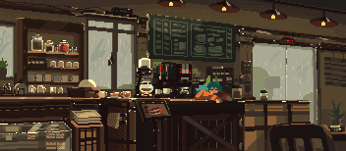

# Hi, I'm Syifa 👋

**Backend & Mobile Developer** based in Indonesia

 

Saya suka ngoding hal-hal yang jalan di belakang layar — API yang gak gampang jebol pas dipakein banyak orang, sama aplikasi mobile yang enak dipegang. Belajar React Native sambil ngoprek Express, biasanya sambil ditemenin kopi yang keburu dingin karena kelamaan mikirin bug.

Lagi fokus benerin fondasi: clean architecture, auth yang aman, dan query database yang gak bikin server ngos-ngosan.

 

## Stack yang sering dipakai

<table>
<tr>
<td valign="top" width="33%">

**Bahasa**
- Java
- JavaScript / TypeScript
- HTML

</td>
<td valign="top" width="33%">

**Framework & Tools**
- Node.js, Express
- Next.js
- React & React Native, Expo
- TailwindCSS
- JWT

</td>
<td valign="top" width="33%">

**Database**
- MySQL
- Supabase
- SQLite

</td>
</tr>
</table>

 

## Project

**[Quantis](https://github.com/Cip-s/Quantis)** — project eksplorasi clean architecture, fokus ke struktur kode yang rapi dan gampang di-maintain jangka panjang.

 

## GitHub Stats

 

## Contact

 

*Thanks for stopping by ☕*

